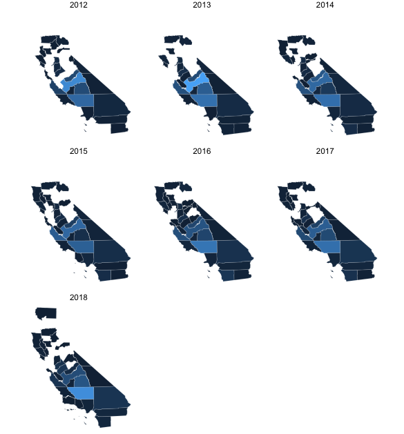
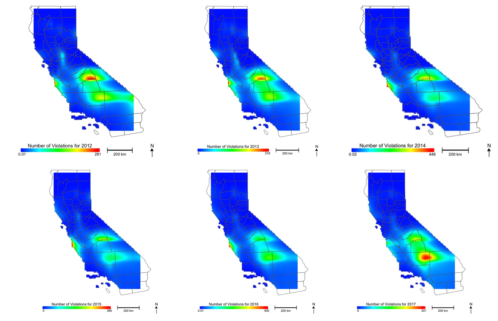
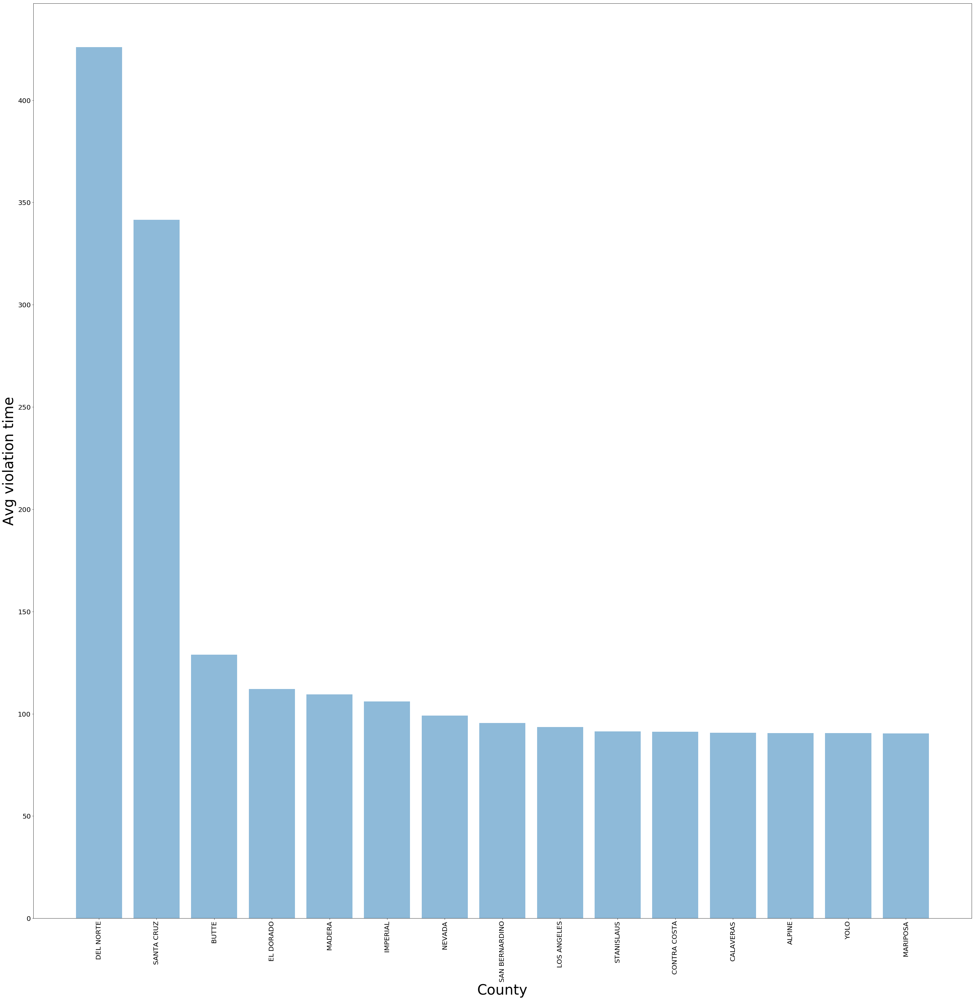

class: inverse 

# Focus: Violations dataset

- ~ 6,400 violations 
- Characteristics: 
  - Violation type
  - Analyte in violation
  - Amount above threshold
  - Date and time of violation.

# Aims

- Where are violations occurring most? Can we model it?
- What are the most common violations?
- What analytes show the largest departure from acceptable threshold on average?
- What is the response time to resolution of violations? Do more affluent counties have quicker resolution times?

---

class: center

### Total Violations per County

```{r, echo = FALSE, out.width="500px", out.height="550px"}

```

---
class: center

## Model of Violations Across California

```{r, echo = FALSE, out.width="600px", out.height="500px"}

```

---

## Top 10 Analytes Found in Violation

|analyte_name                  |    n|
|:-----------------------------|----:|
|ARSENIC                       | 2609|
|NITRATE                       |  898|
|TTHM                          |  878|
|COMBINED URANIUM              |  578|
|TOTAL HALOACETIC ACIDS (HAA5) |  403|
|SWTR                          |  290|
|1,2,3-TRICHLOROPROPANE        |  190|
|FLUORIDE                      |  147|
|NITRATE-NITRITE               |  122|
|GROSS ALPHA PARTICLE ACTIVITY |   64|

---

### Analytes with Largest Median Value Above Recommended Threshold

|analyte_name                  | median_above_threshold|
|:-----------------------------|----------------------:|
|GROSS ALPHA, EXCL. RADON & U  |                180.000|
|URANIUM-238                   |                120.000|
|COMBINED RADIUM (-226 & -228) |                 40.000|
|ASBESTOS                      |                 22.500|
|GROSS ALPHA PARTICLE ACTIVITY |                 18.515|
|NITRATE                       |                 13.000|
|COMBINED URANIUM              |                 11.000|
|MERCURY                       |                 10.998|
|NITRATE-NITRITE               |                  3.000|
|IRON                          |                  1.700|

---
class: center, middle

## Top 15 County Mean Durations of Violation

```{r, echo = FALSE, out.width="600px", out.height="500px"}

```

---
class: center, middle

### Top 10 County Durations of Violation w/ Median County Income

```{r, echo = FALSE, out.width="600px", out.height="450px"}
knitr::include_graphics("images/violation-duration-by-income.png")
```

---
class: inverse, center, middle

## Below The Mean

```{r, echo = FALSE, out.width="450px", out.height="350px"}

```

Left to Right: Sep, Yachen, Indu
---
class: inverse, center, middle

# Thanks!

Slides created via the R package [**xaringan**](https://github.com/yihui/xaringan).
